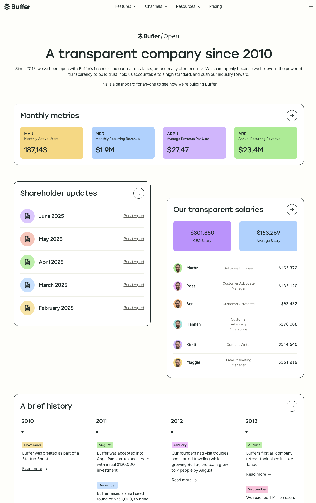

# 快速Copy

快速copy或本地静态化一个网站页面的demo，这个项目copy的是一个国外网站：https://buffer.com/open  
将页面快速保存到本地实现静态话处理，动态数据使用vue3进行二次修改编辑，别的html页面还是默认展示。

# 实现方案

使用wget将要静态化或copy的网站搞到本地，然后直接用浏览器打开或者Vscode中使用live server启动一个服务查看页面是否正常，
如果某些页面需要依赖接口获取数据来支撑，就将html内容搞到vue中当作模板，对于这部分内容进行二次编辑，例如一些图表什么的。

如果某些html页面可以直接使用的，就在vue中直接跳转到这个html页面即可。


# 注意  

如果网站是单页面应用，使用wget可能会出问题，wget适合获取服务端渲染或者纯html页面。
如果某些js或者css文件要通过网络加载，也可以保存到本地手动引入。
如果个别元素出现问题，可以copy网页上的内容将其填充到模板html中。

# 预览

在本地预览本项目使用node 21以上版本，安装好依赖，即可启动:
```
pnpm run dev
```

效果图：  

